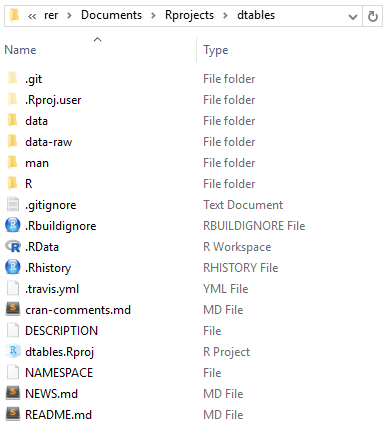

# files
<!--
[](http://cran.r-project.org/package=dtables)
[](http://cranlogs.r-pkg.org/badges/grand-total/dtables)
[](https://travis-ci.org/gitronald/dtables)
-->
* Navigating through files and directories from the R console with the default functions can be a cumbersome, clumsy, and cockeyed process. The aim of `files` is to ease that process and provide a file mapping system that exceeds the informativeness of the beloved  point and click interface that we have come to depend on and accept as 'good enough.'


### Getting Started
<!--
``` {r}
# Install CRAN version:
install.packages("files")
```
-->
```
# Install Github version:
devtools::install_github("gitronald/files")

```

### lf - List Files
* Retrieves your working directory or a directory of your choice and displays it's top-level contents, as well as the contents of each top-level folder within it, as columns in a ragged-bottom `data.frame`

``` {r}
> lf()
```
```
C:/Users/rer/Documents/Rprojects/dtables 

            dtables      data data-raw              man                    R
1        .gitignore iris2.rda  iris2.R      cor_test.Rd           cor_test.R
2     .Rbuildignore                      create_list.Rd        create_list.R
3            .RData                          dfactor.Rd data-documentation.R
4         .Rhistory                              dft.Rd            dfactor.R
5       .travis.yml                         dnumeric.Rd                dft.R
6  cran-comments.md                           dtable.Rd           dnumeric.R
7       DESCRIPTION                        dvariable.Rd             dtable.R
8     dtables.Rproj                    factor_length.Rd          dvariable.R
9         NAMESPACE                            iris2.Rd       write_object.R
10          NEWS.md                     write_object.Rd                     
11        README.md 
```

Compare to Windows point and click view of the same directory:




### df - Describe Files

- View the details (size, time created, time modified, etc.) of a folder's top level contents.


``` {r}
> df()
```
```
                  size isdir mode               mtime               ctime               atime exe
.git                 0  TRUE  777 2016-07-26 17:35:15 2016-06-29 09:52:24 2016-07-26 17:35:15  no
.gitignore          38 FALSE  666 2016-02-10 19:37:48 2016-06-29 09:52:24 2016-06-29 09:52:24  no
.Rbuildignore       94 FALSE  666 2016-05-30 23:26:15 2016-06-29 09:52:24 2016-06-29 09:52:24  no
.RData            9962 FALSE  666 2015-12-24 18:31:14 2016-06-29 09:52:24 2016-06-29 09:52:24  no
.Rhistory        15224 FALSE  666 2016-07-23 09:16:29 2016-06-29 09:52:24 2016-06-29 09:52:24  no
.Rproj.user          0  TRUE  777 2016-06-29 16:15:59 2016-06-29 09:52:29 2016-06-29 16:15:59  no
.travis.yml         30 FALSE  666 2016-05-30 23:26:15 2016-06-29 09:52:24 2016-06-29 09:52:24  no
cran-comments.md   274 FALSE  666 2016-07-07 12:18:55 2016-06-29 09:52:24 2016-07-07 12:18:55  no
data                 0  TRUE  777 2016-06-29 09:52:29 2016-06-29 09:52:29 2016-06-29 09:52:29  no
data-raw             0  TRUE  777 2016-07-26 17:34:51 2016-06-29 09:52:29 2016-07-26 17:34:51  no
DESCRIPTION        470 FALSE  666 2016-07-07 12:18:55 2016-06-29 09:52:24 2016-07-07 12:18:55  no
dtables.Rproj      407 FALSE  666 2016-02-10 19:37:48 2016-06-29 09:52:24 2016-06-29 09:52:24  no
man                  0  TRUE  777 2016-07-22 18:52:59 2016-06-29 09:52:29 2016-07-22 18:52:59  no
NAMESPACE          345 FALSE  666 2016-07-22 18:53:28 2016-06-29 09:52:24 2016-07-07 12:45:49  no
NEWS.md            567 FALSE  666 2016-07-26 17:30:45 2016-06-29 09:52:24 2016-07-26 17:30:45  no
R                    0  TRUE  777 2016-07-22 18:49:59 2016-06-29 09:52:29 2016-07-22 18:49:59  no
README.md         7319 FALSE  666 2016-07-22 17:59:27 2016-06-29 09:52:24 2016-07-10 23:42:32  no
```

